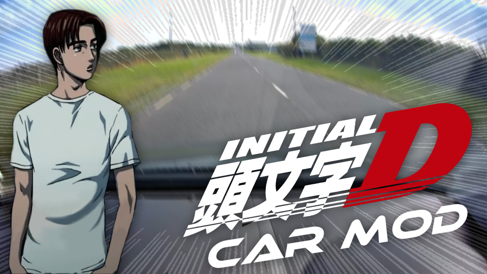

# Initial D Car Mod

Android app to communicate with a OBD-II based car using an ELM327 & ISO9141-2 over Bluetooth.

The app switches to Initial D mode over 5000 RPM. In normal operating mode, it plays calm japanese music.

* [Video Demonstration](https://www.youtube.com/watch?v=zITxyQp5Y24)

